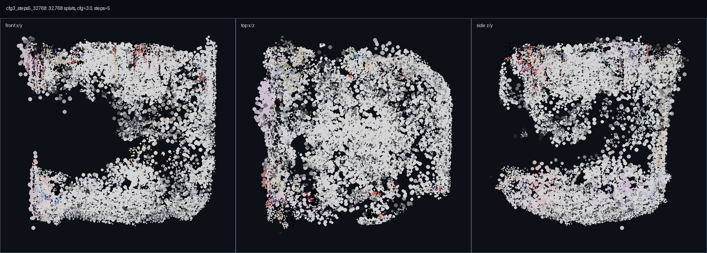
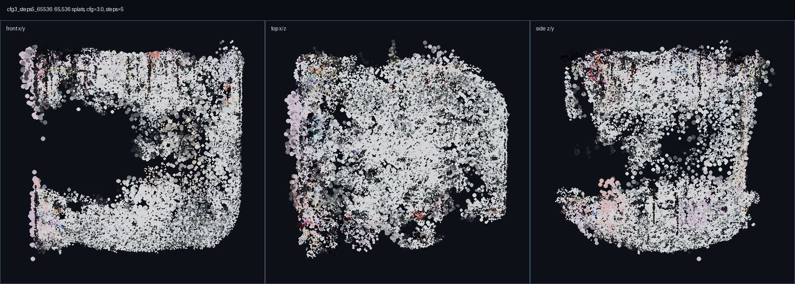
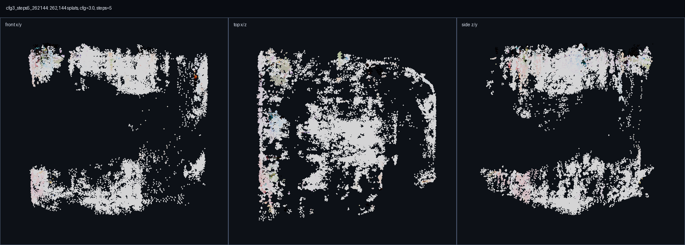

# TripoSplat Backend, Wasm, and Config Sweep Report

Run date: 2026-06-04

## Summary

This pass validates native CUDA TripoSplat CLI output for a low-profile 5-step sweep and verifies backend aliasing uses Burn fusion for both WGPU and CUDA. The wasm app startup UX now opens the Bevy app before any model download, so model selection happens in the app instead of on the launcher.

Wasm model inference is not valid yet. The TripoSG GLB path either stalls through RMBG or returns an empty mesh with `rmbg_model=none`; the TripoSplat browser path loads all f32 model parts but then holds about 42 GiB in Chromium with no GPU SM activity for several minutes. Those paths are now explicit Playwright smoke gates instead of default checks.

## Validation Matrix

| Area | Command / Evidence | Result |
| --- | --- | --- |
| Fusion aliases | `cargo test -p burn_synth --features wgpu,cuda backend_alias_uses_burn_fusion -- --nocapture` | Pass. WGPU and CUDA aliases resolve to Burn fusion backends. |
| Native WGPU smoke | `BURN_WGPU_SMOKE=1 cargo test -p burn_synth --features wgpu wgpu_tensor_smoke -- --nocapture` | Pass. Backend printed `fusion<cubecl<wgpu<spirv>>>`. |
| Native CUDA smoke | `BURN_CUDA_SMOKE=1 cargo test -p burn_synth --features cuda triposplat_cuda -- --nocapture` with CUDA 12.9 root | Pass. CUDA preflight and large-attention smokes pass. |
| CUDA stage diagnostic | `TRIPOSPLAT_CUDA_STAGE_PARITY=1 cargo test -p burn_synth --features cuda triposplat_cuda_stage_parity_reference_tensors -- --nocapture` | Pass as diagnostic. Numeric deltas are reported but not threshold-gated. |
| Native CUDA CLI e2e | `burn_synth splat --backend cuda --num-steps 5 --guidance-scale 3.0 --gaussians 32768,65536,262144` | Pass. Three finite `.splat` outputs generated. |
| Wasm app UX | `npx playwright test --config playwright.config.mjs --workers=1 --reporter=list` | Pass: 3 passed, 3 gated/skipped. Bevy app starts before model download. |
| Wasm TripoSG GLB | `BURN_SYNTH_WEB_TRIPOSG_SMOKE=1 ... -g "parts-based web inference"` | Blocked. `rmbg_model=none` returns empty mesh; RMBG path previously idled without progress. |
| Wasm TripoSplat e2e | `BURN_SYNTH_WEB_TRIPOSPLAT_SMOKE=1 ...` | Blocked. f32 parts load, then browser holds ~42 GiB with no SM utilization and no output. |

## CUDA Config Sweep

Input: `tmp/runs/20260604T074500Z_triposplat_cuda_alpha_reference/input_chair_alpha.png`

Settings shared by this sweep:

| Setting | Value |
| --- | --- |
| Backend | CUDA via staged CUDA 12.9 runtime |
| Precision | TripoSplat f32 burnpacks |
| Steps | 5 |
| CFG guidance | 3.0 |
| Shift | 3.0 |
| Seed | 42 |
| Erode radius | 1 |

GPU sampler evidence: `tmp/runs/20260604T195602Z_triposplat_cuda_sweep/gpu.csv`

Summary sidecar: `assets/cuda_sweep_gpu_summary.json`

| Metric | Value |
| --- | --- |
| Samples | 89 |
| Max GPU util | 100% |
| Mean GPU util | 35.45% |
| Max VRAM | 17,667 MiB |
| Max power | 484.48 W |

## Output Matrix

The previews below are orthographic point-proxy renders from exported `.splat` records. They are not a full 3DGS renderer, but they are useful for quick shape/color review and blank-output detection.

| Gaussians | Output | Stats | Preview |
| ---: | --- | --- | --- |
| 32,768 | `tmp/runs/20260604T195602Z_triposplat_cuda_sweep/cfg3_steps5_32768.splat` | `assets/cfg3_steps5_32768_stats.json` |  |
| 65,536 | `tmp/runs/20260604T195602Z_triposplat_cuda_sweep/cfg3_steps5_65536.splat` | `assets/cfg3_steps5_65536_stats.json` |  |
| 262,144 | `tmp/runs/20260604T195602Z_triposplat_cuda_sweep/cfg3_steps5_262144.splat` | `assets/cfg3_steps5_262144_stats.json` |  |

## Output Correctness Checks

| Gaussians | Bytes | Non-finite | Positive alpha | Positive scale components |
| ---: | ---: | ---: | ---: | ---: |
| 32,768 | 1,048,576 | 0 | 30,446 | 98,304 |
| 65,536 | 2,097,152 | 0 | 59,553 | 196,608 |
| 262,144 | 8,388,608 | 0 | 233,637 | 786,432 |

## Wasm UX Notes

The wasm launcher now only initializes the wasm module and starts the Bevy app. It no longer exposes pipeline, foreground, or quality selectors before the app loads. Query parameters such as `synthesis_model=triposplat`, `triposplat_profile=low`, and `weights_precision=f32` still work as reproducible deep links, while visible pipeline/profile changes are made in the Bevy top bar and settings modal.

Default Playwright now verifies:

- The launcher has no model selector controls.
- Query params remain intact for deep links.
- The Bevy canvas appears.
- Startup does not request `.bpk` model artifacts before inference.

## Open Blockers

1. Native TripoSplat WGPU remains fail-fast. WGPU fusion itself is validated, but the native TripoSplat WGPU runtime is still intentionally disabled until a clean e2e backend smoke exists.
2. Wasm TripoSG GLB inference is not valid. With `rmbg_model=none`, it returns `TripoSG mesh extraction returned an empty mesh`; with RMBG enabled, the browser path idles during RMBG hydration.
3. Wasm TripoSplat f32 e2e is still pathological. It fetches all four required component manifests and parts, then holds about 42 GiB in Chromium with no GPU SM utilization and no output.
4. CUDA stage parity remains diagnostic-only. It reports deltas but does not enforce pass/fail numeric thresholds yet.
