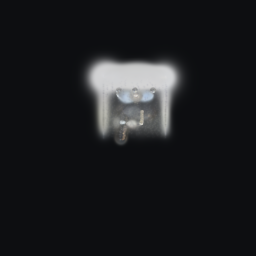
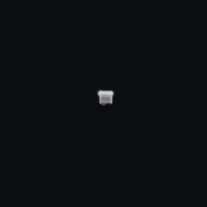
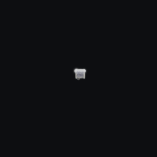

# TripoSplat Gaussian Render PSNR Check

Run ID: `20260616T135731Z_triposplat_render_psnr`

This report adds a deterministic render-level check for TripoSplat Gaussian outputs. It is not a replacement for a true `gsplat`/Bevy GPU renderer comparison; the local upstream Python environment had Torch/NumPy but no `gsplat` or `diff_gaussian_rasterization` package available. The new `triposplat_render_compare` tool also supports direct PNG-vs-PNG PSNR so a true external renderer capture can be compared once that dependency is installed or a Bevy screenshot capture is available.

## Tooling

Added:

```sh
cargo run -p burn_triposplat --features import --bin triposplat_render_compare -- \
  --reference-splat REF.splat \
  --candidate-splat CANDIDATE.splat \
  --reference-render ref.png \
  --candidate-render candidate.png \
  --report report.json \
  --min-psnr 35
```

The tool can also compare renderer screenshots directly:

```sh
cargo run -p burn_triposplat --features import --bin triposplat_render_compare -- \
  --reference-image gsplat.png \
  --candidate-image bevy.png \
  --report render_psnr.json \
  --min-psnr 35
```

## Results

| Check | Reference | Candidate | PSNR | Status |
|---|---|---|---:|---|
| Decoder replay, upstream points + upstream features | Python/CUDA `.splat` | Burn/WGPU replay `.splat` | 65.45 dB | Pass |
| Decoder replay, upstream points + Burn features | Python/CUDA `.splat` | Burn/WGPU decoder-feature `.splat` | 68.19 dB | Pass |
| Full-sample latent impact, same Burn decoder | Python reference latent decoded by Burn/WGPU | Burn/WGPU sampled latent decoded by Burn/WGPU | 54.81 dB | Pass |

## Renderings

### Decoder Replay

Reference:


Burn/WGPU replay:


### Decoder Features

Reference:



Burn/WGPU decoder features:


### Full Latent Decode

Reference latent decoded through Burn:



WGPU candidate latent decoded through Burn:



## Interpretation

The render-level checks are green for decoder replay and for the known full-sample latent outlier case. This narrows the visibly-wrong splat issue away from decoder Gaussian emission and toward renderer/display-space integration, which is addressed separately in the Bevy adapter and thumbnail path.

Remaining strict renderer parity work:

- Capture a true Python `gsplat` or upstream Spark render once the dependency is available.
- Capture a true Bevy `bevy_gaussian_splatting` render target or browser screenshot.
- Compare those two PNGs with `triposplat_render_compare --reference-image ... --candidate-image ...`.

