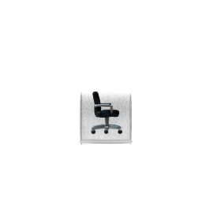
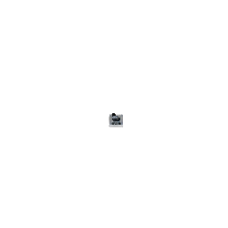
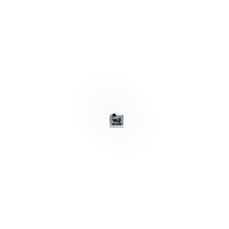

# TripoSplat gsplat Render E2E Check

Run ID: `20260616T_e2e_gsplat_render`

This report validates TripoSplat Gaussian outputs at the final rendered-image level using `gsplat` in the local Torch venv:

```bash
source ~/.venvs/torch/bin/activate
CUDA_HOME=/usr CUDA_PATH=/usr TORCH_CUDA_ARCH_LIST=9.0+PTX \
CPATH=$PWD/tmp/runs/20260616T_e2e_gsplat_header_bootstrap/sysroot/usr/include/python3.14:$PWD/tmp/runs/20260616T_e2e_gsplat_header_bootstrap/sysroot/usr/include \
CPLUS_INCLUDE_PATH=$PWD/tmp/runs/20260616T_e2e_gsplat_header_bootstrap/sysroot/usr/include/python3.14:$PWD/tmp/runs/20260616T_e2e_gsplat_header_bootstrap/sysroot/usr/include \
python scripts/triposplat_gsplat_render.py ...
```

The renderer uses orthographic shared-camera framing per compared pair, `256x256`, background `[0.05, 0.055, 0.065]`, and `gsplat.rasterization` on CUDA. PNG comparisons use `triposplat_render_compare` over RGB channels with a `35 dB` minimum PSNR gate.

## Environment

- Python venv: `~/.venvs/torch`
- Torch: `2.12.0+cu130`
- gsplat: `1.5.3`
- GPU: `NVIDIA RTX PRO 6000 Blackwell Workstation Edition`
- Driver: `595.71.05`
- CUDA compile workaround: system `CUDA_HOME` pointed at missing `/usr/local/cuda-12.8`; `/usr/bin/nvcc` is CUDA `12.4` and cannot compile native `compute_120`, so this run used `TORCH_CUDA_ARCH_LIST=9.0+PTX` plus locally extracted Python 3.14 headers under `tmp/runs/20260616T_e2e_gsplat_header_bootstrap/sysroot`.

## Results

| Check | Reference | Candidate | PSNR | Mean Abs | Max Abs | Pass |
| --- | --- | --- | ---: | ---: | ---: | --- |
| Decoder replay features | `upstream_points_features_32768.splat` | `upstream_points_burn_features_32768.splat` | `94.08 dB` | `0.00003` | `1` | yes |
| Full latent sample | `reference_latent_burn_decode_32768.splat` | `candidate_latent_burn_decode_32768.splat` | `52.00 dB` | `0.05374` | `57` | yes |
| Upstream export vs Burn decode | `reference_32768.splat` | `reference_latent_burn_decode_32768.splat` | `49.30 dB` | `0.06091` | `81` | yes |

## Render Artifacts

| Check | Reference render | Candidate render | JSON |
| --- | --- | --- | --- |
| Decoder replay features |  |  | [`decoder_replay_gsplat_render_compare.json`](assets/decoder_replay_gsplat_render_compare.json) |
| Full latent sample |  |  | [`full_latent_gsplat_render_compare.json`](assets/full_latent_gsplat_render_compare.json) |
| Upstream export vs Burn decode |  |  | [`upstream_vs_burn_reference_gsplat_render_compare.json`](assets/upstream_vs_burn_reference_gsplat_render_compare.json) |

## Timing Notes

Mean gsplat render timing after one warmup:

| Render | Visible Gaussians | Tiles Sum | Mean Render Time |
| --- | ---: | ---: | ---: |
| `decoder_replay_reference_shared_gsplat` | `29,872` | `24,875` | `0.52 ms` |
| `decoder_replay_burn_features_shared_gsplat` | `29,872` | `24,876` | `0.54 ms` |
| `full_latent_reference_shared_gsplat` | `31,036` | `20,941` | `1.50 ms` |
| `full_latent_candidate_shared_gsplat` | `31,050` | `20,963` | `1.51 ms` |
| `upstream_reference_shared_gsplat` | `29,872` | `20,296` | `1.47 ms` |
| `burn_reference_latent_shared_gsplat` | `31,036` | `20,941` | `1.52 ms` |

## Interpretation

The decoder replay render is effectively identical under gsplat, so the Burn decoder feature path is not the source of visible Gaussian corruption in that controlled replay.

The full latent sample and upstream-export comparisons both pass the image-level threshold, but they are not bit-identical. The remaining visual delta is consistent with the known full-sample latent mismatch and export/packing quantization, not with a wholesale renderer or Gaussian-count failure.

This report does not include a Bevy framebuffer PSNR comparison. The current reusable Bevy headless path in upstream `bevy_gaussian_splatting` loads `.ply` and uses its own fixed camera; a clean renderer-to-renderer PSNR gate needs a repo-specific Bevy capture tool that uses the same shared camera/framing as `scripts/triposplat_gsplat_render.py`.
